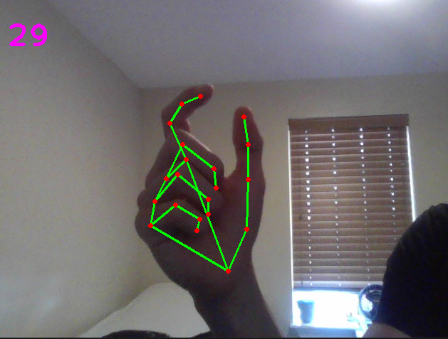

## Hand Tracking
___
### What does it look like?
  
Hand Tracking is a great way to practice OpenCV. First off, it looks awesome. Second, it guides us into making full body-detecting applications. By feeding data into something like sklearn, you can teach it to give you hints on handwriting, golfing, weight-lifting, or other sports. 

## Suggested Resources
- [Advanced Computer Vision](https://www.youtube.com/watch?v=01sAkU_NvOY&t=3010s)