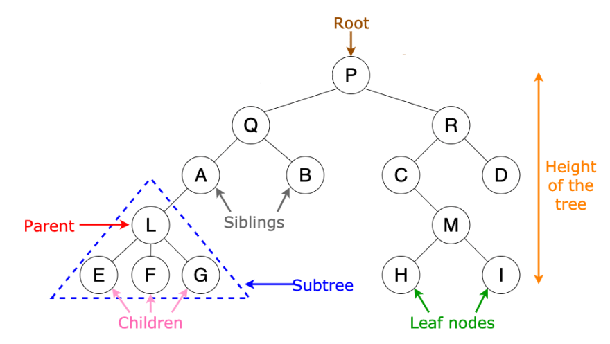

# Trees
Complexity is generally O(log(n))


As the name suggests the Data type of Tree was originally inspired by nature itself making this a very interesting orgin story.

Trees are like lists but have links to other nodes connected together by pointers. A tree can connect to multiple different nodes. The easiest Tree to think about is called the Bianary search Tree meaning each node only connects to 2 nodes beneath it max.

 

First of all the biggest advantage to using a BST is that searching through the data is always O(log(n)) which is awesome and very useful! this makes it very easy to traverse through the data.


What you are seeing here is a Binary Search tree or BST



Lets break down the different portions of a BST!

## Root
The top node is called the root node
Interestingly enough as you traverse down the tree you look at the Subtree (see above) and it becomes the new BST to look at making it the "root" 
## Leaf
Any node that connects to no other nodes are called leaf nodes.
## Parent 
A node that has connected nodes is called a parent node.
>Note Children nodes can also be Parent nodes and vice versa
## Children
The node connected to the parent are called child nodes.
## Siblings
They have the same parent Node

A lot of these terms may seem a little odd to have been named at the moment but these terms will come in handy when we start to build a BST

To do that we will mostly use Classes that we created that we will call **Nodes**
>Nodes Definition: A point at which lines or pathways intersect or branch; a central or connecting point.

Lets start Diving into the code.
If you do not understand how classes work that is ok you should still be able to follow along and see overall what is going on.
```python
class BST:
    def __init__(self, val=None):
        self.left = None
        self.right = None
        self.val = val


```
All we are doing above is Initializing the tree.

So how do we insert data into a BST?
Well lets think about this. If the node doesn’t have a value, we should be able to just set the given value and return. if the number already exists, we will simply return that same number. 

If the data value is less than the nodes value we are currently looking at and we already have a child node to the left then we recursively (I am also assuming this was explained in a previous tutorial with like dictionaries) can call insert on our left child. If we don’t have a child on the left yet then we just make the data our new child on the left side. We can do the same backwards for our right side!

```python
def insert(self, val):
        #If the node we are looking at has no value than set the data in it
        if not self.val:
            self.val = val
            return
        #If the value equals the value of the node than you can return
        if self.val == val:
            return
        #if the value is less than the value in the node than go to the left
        if val < self.val:
            if self.left:
                self.left.insert(val)
                return
            self.left = BSTNode(val)
            return
        #if it is greater than the value go to the right
        if self.right:
            self.right.insert(val)
            return
        self.right = BSTNode(val)
```   
 

Lets try and put this in perspective. Given this tree and the number 5 is what you want to insert what would happen?

1. It would compare to the Root node of 8 and than go to the left
2. It is bigger than three though so it will go to the right
3. It is smaller than 6 and will go to the left
4. It is bigegr than 4 and will go to the right 
5. It will place the 5 to the right of the node with the value of 4

Something that is really easy and also can be very important with a tree is finding what the smallest and largest numbers are.
- The largest number will be the number to the right the farthest
- The smallest number will be the farthest to the left

You can probably already think of a simple way to do this but I will show you nonetheless
```python
#Can you see how we just quickly head to the left until we hit the end?
def get_min(self):
        current = self
        while current.left is not None:
            current = current.left
        return current.val
#Similar thing for the Max value
def get_max(self):
        current = self
        while current.right is not None:
            current = current.right
        return current.val
```

What about finding the height of the Tree? 
```python
def maxHeight(node):
    if node is None:
        return 0
 
    else :
 
        # find the height of each subtree
        lheight = maxHeight(node.left)
        rheight = maxHeight(node.right)
 
        # Use the larger one
        if (lheight > rheight):
            return lheight+1
        else:
            return rheight+1
```
This one is also very simple. You can see how recursion plays a huge role in many of these functions but here we can see that we compute which one is bigger and than use that one as our number.


## Balancing
Another important portion of a BST is if it is balanced or not. 

Lets look at an example
```
          4
        /   \
       3     5
      /       \
     2         6 
    /           \
   1             7
```
Does this look efficient to you?
No... the answer is no

Why?

This would end up being more akin to a linked list than a tree and that is not our designated idea. This gets rid of many of the traits that makes a BST great! we lose our searching O(log(n)) value and we want to keep that. So our solution should be to make it look more along the lines of 
```
       4
    /    \
   2      6
 /  \    /  \
1    3  5    7 
```
This may seem tough but can you find a way to rotate simply through the code and find a way to balance the numbers like seen above? see the code below and how it traverses the BST and rotates numbers until the height and locations is balanced?

Here is a starting hint
```python
class BST:
    def __init__(self, val=None):
        self.left = None
        self.right = None
        self.val = val

def sorted_bst(number):
    if not number:
        return None
    else:
        """search through the list by comparing the  
        middle value of the number and the nodes to the left and right
        """
        return node

def print_order(node): 
    if not node: 
        return

    
    """
     the purpose of this code is to print the numbers in the same way we ordered it above
    """
result = sorted_bst([1, 2, 3, 4, 5, 6, 7])

print_order(result)

```
[ <font size="4"> Solution to Trees</font>](Solutions\treessolution.py)
